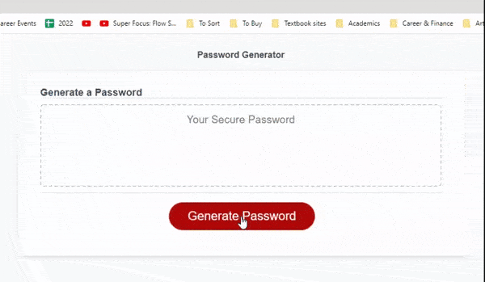
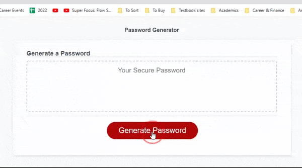

# Password-Generator

## Description 

Welcome to my password generator project.

This project aims to showcase my ability in javascript by presenting a solution to the real life problem of generating strong passwords for greater security.

To generate a random password that satisfies their criteria, the user is asked to choose a password length within a specific range:



and at least one character type:



## Technologies Used

In order to do this project, I used Javascript, HTML, CSS, git, and github.

I added javascript functions to a given starter code in which I utilized prompts and alerts to retrieve user inputs and choices.

```
//Create prompt to include special characters
function getSpecialPrompt() {
  var userChoice = window.prompt("Do you want special characters? (y/n):");
  var stillNeedChoice = true;
  do {
    if (userChoice === "y") {
      stillNeedChoice = false;
      allChoicesArray += specialCharList.split(" ").toString();
      atLeastOneCharType = true;
    } else if (userChoice === "n") {
      stillNeedChoice = false;
    } else if (userChoice !== "y" || userChoice === "n") {
      window.alert("Please enter y or n");
      userChoice = window.prompt("Do you want special characters? (y/n):");
    }
  } while (stillNeedChoice)
}
```

## Links

[Deployed Website](https://zzzorigtbaatar.github.io/Password-Generator/)

[Project Repository](https://github.com/zzzorigtbaatar/Password-Generator)

## Credits

* Jerome Chenette, UC Berkeley Extension Coding BootCamp

* https://www.w3schools.com/js/js_scope.asp

* https://www.w3schools.com/js/js_window.asp

## License

[LICENSE](/LICENSE)

## Contact Me

https://zzzorigtbaatar.github.io/My-Portfolio

https://www.linkedin.com/in/zorizulkhuu/